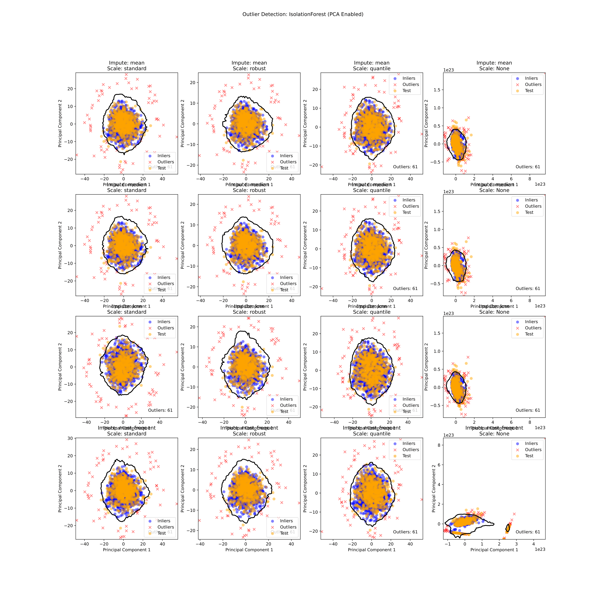

# Outlier Detection

Here, we designed a pipeline to systematically evaluate and optimize outlier detection methods, combined with imputation and standardization strategies, on the given training dataset. The primary goal is to identify the most effective configuration for isolating anomalies in data.

## **Data Preprocessing**:

- **Imputation**: Missing values in the dataset are handled using one of several imputation techniques: `mean`, `median`, `knn`, and `most_frequent`.
- **Standardization**: Imputed data is then scaled with a variety of techniques (`standard`, `robust`, `quantile` or None), which is crucial for stabilizing the data distribution and enhancing the effectiveness of outlier detection.

So in total, there are 16 different combinations of imputation and scaling methods, which are evaluated in the pipeline. The plots `plots/impute_scale_pca.pdf` and `plots/impute_scale_tsne.pdf` visualize the impact of each imputation and scaling method on the data distribution, using PCA and t-SNE transformations, respectively.

## **Outlier Detection**:

Three primary detection algorithms (`OneClassSVM`, `IsolationForest`, `LocalOutlierFactor`) are applied to each combination of imputation and scaling. The techniques are applied on the training dataset. For that, we considered two cases:

    - First reduce the training data to 2D using PCA and then apply the outlier detection method.
    - Second, apply the outlier detection method directly on the training data.

For the second case, we obviosuly cannot plot the decision boundary, but we can still visualize the outliers. All the plots are saved in the `plots` directory.

On of the best performing method is `IsolationForest` (with PCA transformation to 2D):

A general observation is, that PCA transformation really results in a much better separation of the outliers from the inliers. This is also reflected in the evaluation metrics. This suggests that there are a lot of correlated features in the data, which can be captured by PCA.

## **Evaluation**:

In order to compare how well the outlier detection method worked, we compared the processed training distribution to the test distribution. We calculated the mean, variance, skewness, and kurtosis of the training and test data, with and without outliers.

The pipeline’s evaluation results demonstrate that the best-performing setup utilizes `most_frequent` imputation, `quantile` scaling, and `IsolationForest` detection, as seen in the PCA visualization (`best_method.pdf`). Nearly as good is the `most_frequent` imputation, `quantile` scaling, and `OneClassSVM` detection.

Here we show one of the best performing method, namely `IsolationForest` (with PCA transformation to 2 components) with `most_frequent` imputation and `quantile` scaling:

