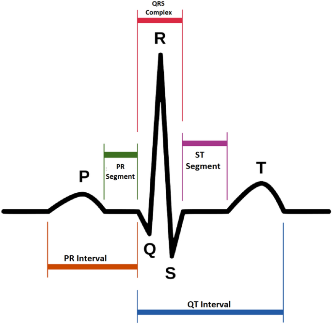

# Heart Rhythm Classification from Raw ECG Signals

This project involves classifying heart rhythms based on raw ECG signals. Our goal is to develop a model capable of distinguishing between different rhythm classes using time-series data. The dataset provides raw ECG recordings sampled at 300 Hz, containing variable-length signals with up to 17,807 data points per sample.

## Data Description

The dataset includes three main files:

- **`train.csv`**: Training data with labeled ECG signals.
- **`test.csv`**: Testing data without labels, used for model evaluation.
- **`sample_submission.csv`**: A template for submitting predictions.

Each row in `train.csv` and `test.csv` represents an ECG signal indexed by an ID, with up to 17,807 measurements. Due to variable signal lengths, some rows contain NaN values after the last recorded measurement, which can be ignored.

### ECG Signal Structure

The ECG signal represents the heart's electrical activity, capturing characteristic patterns such as the P wave, QRS complex, and T wave. Segmentation into these "heartbeat templates" allows us to analyze individual beats and extract meaningful features.


Key features may include amplitude, intervals between peaks, and the shape of the QRS complex.

## Feature Extraction

Each ECG sample is a sequence of data points that can be segmented into heartbeat templates (highlighted areas of the following image):


If we take a close look at one heartbeat template, we can observe the following:



We use `biosppy` library to extract heartbeat templates from the raw ECG data.

## Model

Our model is trained to classify ECG signals into four classes based on extracted features. The final model is evaluated using the **F1 score** with micro-averaging across classes.

## Evaluation Metric

The evaluation metric for this task is the **F-measure (F1)** which ranges from 0 to 1.

In other words, it is the harmonic mean between precision and recall. Mathematically, the formula is:

$$
F1 = 2 \cdot \frac{precision \cdot recall}{precision + recall}
$$

For multi-class classification, we compute the micro-averaged F1 score:

```python
from sklearn.metrics import f1_score
f1_score(y_true, y_pred, average='micro')
```

## Submission

To evaluate our model, we submit predictions to Kaggle in a CSV format with `id` and `y` (predicted class):

```txt
id,y
0,2
1,0
2,2
```
