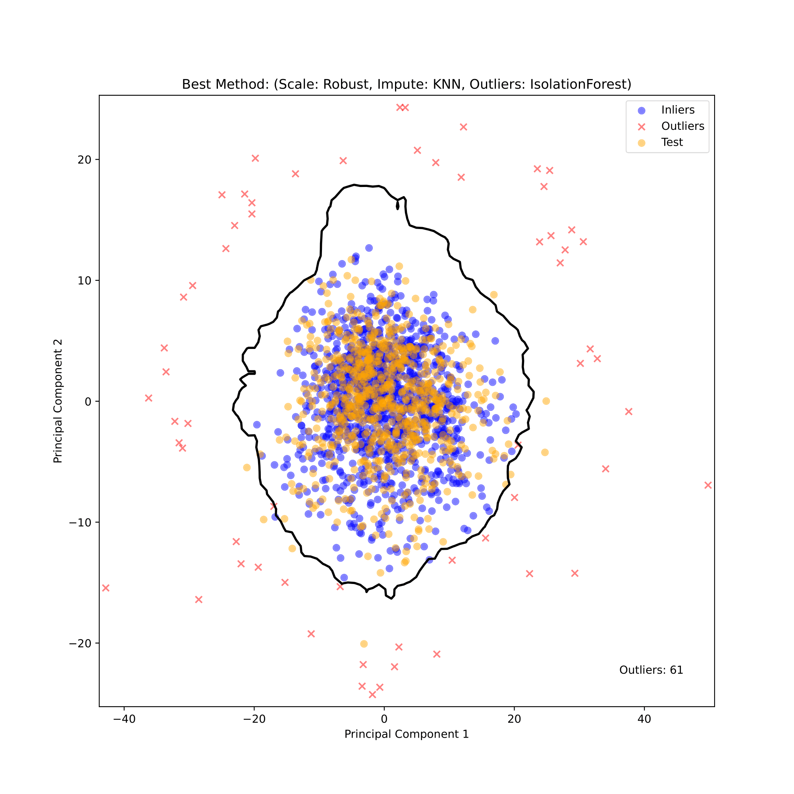
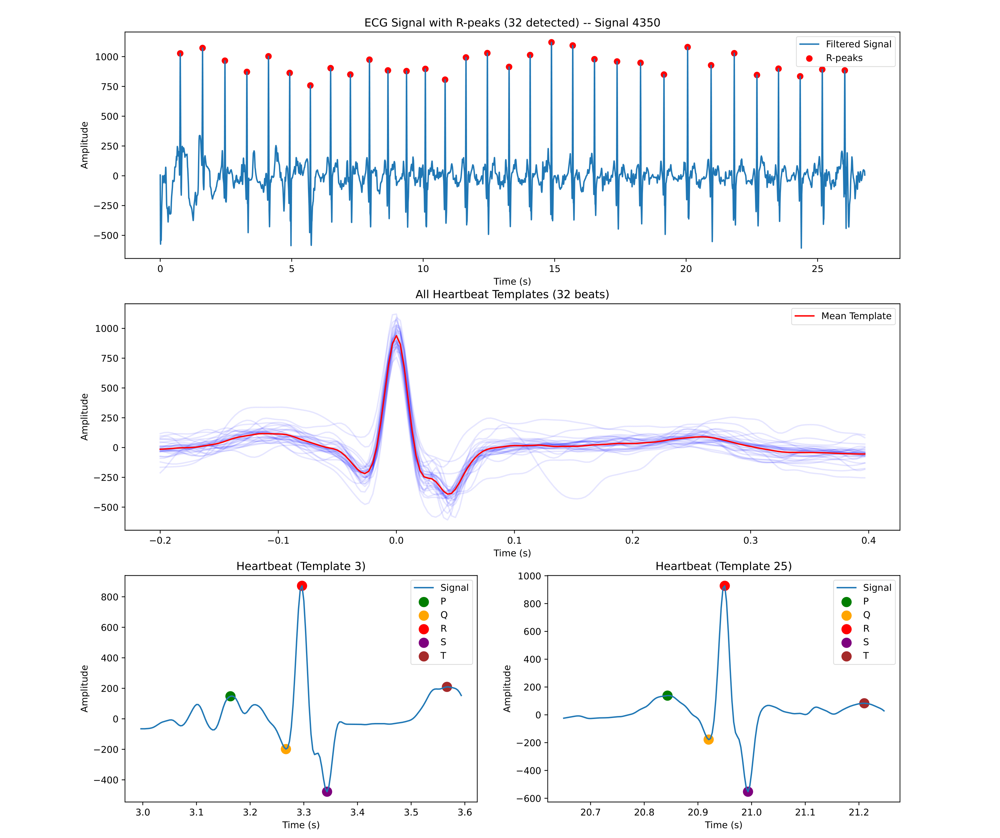

# Advanced Machine Learning (ETH, Autumn 2024)

Coding assignments of the "Advanced Machine Learning" course at ETH Zürich (Fall 2024).

## Project 0: Iris Prediction

Dummy task to get familiar with the platform. The goal is to train an estimator that predicts the type of Iris for the flowers given in the dataset.

## Project 1: Predicting age from brain MRI features

This project tackles the task of predicting a person’s age based solely on brain MRI data. As the brain undergoes characteristic structural changes with age, MRI scans hold valuable information that can reveal age-related patterns. This project leverages machine learning to extract these patterns, aiming to provide accurate age predictions from processed MRI features.

Our workflow includes handling missing data, identifying and removing outliers, selecting the most relevant features, and fine-tuning regression models. The goal: to develop a model that can generalize well on unseen data.

- **Outlier Detection**:
  </img>
  To identify outliers, we first scaled the data using `RobustScaler` to mitigate the influence of outliers on scaling. We then imputed missing values with KNN-imputation and applied PCA for dimensionality reduction to 2D. Using the reduced dataset, we implemented the Isolation Forest algorithm to classify outliers, identifying 61 outliers from the initial 1212 samples.

- **Missing Values Imputation**: After outlier removal, we standardized the data with `StandardScaler` and again applied KNN-imputation to address any remaining missing values.

- **Feature Selection**: The dataset originally contained 832 features. We began by applying Mutual Information to select the top 600 features. Next, we filtered features based on their correlation: features with a correlation coefficient >0.09 with the target variable (age) were retained, resulting in 204 features. We further removed features with inter-feature correlation >0.9, eliminating 30 highly correlated features, leaving us with a refined set of 174 features.

- **Regression Model**: Our experiments identified Support Vector Regression (SVR) with an RBF kernel as the top-performing model. Using `GridSearchCV`, we optimized SVR hyperparameters to `C=55.9` and `\epsilon=0.0001`. To further improve model performance, we utilized a `StackingRegressor` combining SVR with `KNeighborsRegressor`, also optimized with GridSearchCV to `n_neighbors=3`, `weights='distance'`. For the final estimator in the stack, we employed an SVR model with a linear kernel.

## Project 2: Heart rhythm classification from raw ECG signals

</img>
This project aims to classify time-series data from electrocardiogram (ECG) signals, capturing the electrical activity of the heart. The challenge lies in handling variable-length signals, addressing missing data, and extracting meaningful numerical features to build an accurate classification model. The dataset is highly imbalanced, with the majority class (Class 0) comprising 59.2% of samples and the minority class (Class 3) only 3.3%.

Our workflow involved preprocessing the raw ECG signals, including the detection of R-peaks and delineation of characteristic waveforms using the `biosppy` and `neurokit2` libraries. Features such as RR intervals, heart rate, PR intervals, QRS duration, and wave amplitudes (P, Q, R, S, T) were extracted. For each of these signals, we calculated statistical features including mean, standard deviation, median, skewness, kurtosis, entropy, and others, resulting in a comprehensive feature set of 218 numerical features per signal.

</img>
To address the class imbalance, we applied random oversampling of the minority classes. The data was imputed using mean imputation and scaled to the range [-1, 1] using MinMaxScaler.

For _classification_, we implemented a _stacking model_ combining _Histogram Gradient Boosting_, _XGBoost_, and _Support Vector Classifier_, with _Logistic Regression_ as the meta-classifier. This ensemble approach demonstrated robust performance, particularly for minority classes, achieving the a F1-score (micro-averaged) of 0.8369 on a 20% validation split.

The plot below visualizes the feature extraction process, showcasing R-peak detection and heartbeat templates derived from raw ECG signals (using `biosppy`):

